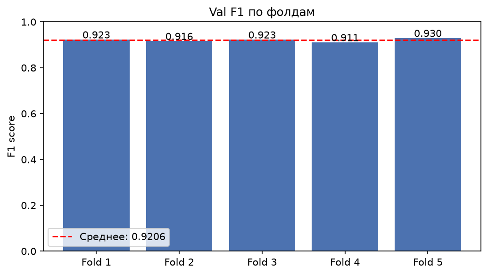

# Weather Classification 🌦️

Классификация погодных условий (дождь / туман / снег) по изображению с камеры — модуль компьютерного зрения для системы автономного вождения.

**Итоговый результат: Macro F1 = 0.928**

---

## Задача

По изображению сцены определить одно из трёх погодных состояний:

| Метка | Класс |
|---|---|
| 0 | rain (дождь) |
| 1 | fog (туман) |
| 2 | snow (снег) |

Погодные условия напрямую влияют на работу алгоритмов управления автономным транспортом, поэтому точность и стабильность классификации критичны.

---

## Результат и путь экспериментов

Решение развивалось итеративно — от собственной архитектуры с нуля до ансамбля дообученных предобученных моделей:

| Подход | Val F1 |
|---|---|
| Собственная ResNet с нуля | 0.38 |
| ResNet18, transfer learning (только классификатор) | 0.80 |
| ResNet50, fine-tuning (разморозка `layer4`) | **0.928** |
| EfficientNet-B0, 5-fold CV + ансамбль | 0.90 |

**Вывод:** transfer learning дал наибольший прирост качества (0.38 → 0.80) практически бесплатно — предобученные на ImageNet признаки уже хорошо разделяют визуальные паттерны дождя/тумана/снега. Дальнейшее дообучение последнего свёрточного блока (`layer4`) с осторожным learning rate и усиленной регуляризацией дало финальный прирост до 0.928.

### Графики




---

## Данные

- 2087 изображений, 3 класса, распределены относительно равномерно (fog: 637, rain: 698, snow: 752)
- Единый размер 512×512, RGB, без повреждённых файлов
- Полный разведочный анализ (EDA) — в `notebooks/01_eda.ipynb`

Датасет не включён в репозиторий — скачайте по ссылкам из задания и распакуйте:

```
data/
├── train/train/{class}/{image}.png
└── test/test/{image}.png
```

---

## Структура проекта

```
weather-classification/
├── README.md
├── requirements.txt
├── data/                          # датасет (не в git)
├── notebooks/
│   ├── 01_eda.ipynb               # разведочный анализ
│   ├── 02_my_resnet.ipynb   # своя ResNet, F1=0.38
│   ├── 03_resnet18.ipynb         # ResNet18/50, F1=0.80-0.928
│   └── 04_resnet50_kfold.ipynb            # EfficientNet + k-fold, F1=0.90
├── src/
│   ├── dataset.py                 # трансформы, TestDataset
│   ├── model.py                   # create_model (ResNet50)
│   ├── train.py                   # обучение, k-fold, графики
│   └── predict.py                 # инференс, ансамбль, сохранение CSV
├── models/                        # веса обученных моделей (не в git)
├── app/
│   └── main.py                    # FastAPI-сервис
└── results/                       # графики для README
```

---

## Установка

```bash
git clone <repo_url>
cd weather-classification
pip install -r requirements.txt
```

Скачайте датасет по ссылкам из задания и распакуйте в `data/train` и `data/test`.

---

## Воспроизведение результата

Откройте и выполните по порядку:

1. `notebooks/01_eda.ipynb` — разведочный анализ данных
2. `notebooks/02_my_resnet.ipynb` — baseline с нуля
3. `notebooks/03_resnet18.ipynb` — финальная модель (ResNet50, fine-tuning), сохраняет веса в `models/`
4. `notebooks/04_resnet50_kfold.ipynb` — альтернатива с k-fold ансамблем

Веса моделей после обучения появятся в `models/model_fold_*.pth` — они нужны для запуска API-сервиса.

---

## API-сервис

Модель обёрнута в FastAPI-сервис с эндпоинтом `/predict`, принимающим изображение и возвращающим предсказанный класс с распределением вероятностей.

### Запуск

```bash
cd app
uvicorn main:app --reload --port 8000
```

Откройте `http://127.0.0.1:8000/docs` — интерактивная документация Swagger, где можно загрузить изображение прямо в браузере.

### Пример запроса

```bash
curl -X POST "http://127.0.0.1:8000/predict" -F "file=@test_image.png"
```

### Пример ответа

```json
{
  "label": "fog",
  "confidence": 0.87,
  "probabilities": {
    "rain": 0.05,
    "fog": 0.87,
    "snow": 0.08
  }
}
```

---

## Технический стек

- **PyTorch / torchvision** — обучение и transfer learning (ResNet18, ResNet50)
- **scikit-learn** — метрики (macro F1), StratifiedKFold
- **FastAPI / uvicorn** — инференс-сервис
- **pandas, matplotlib** — анализ данных и визуализация

## Ключевые технические решения

- **Transfer learning вместо обучения с нуля** — критично для датасета такого размера (~1360 train-изображений)
- **Дифференцированный learning rate** — маленький LR + сильный weight decay для дообучаемого `layer4`, больший LR для головы классификатора — снижает риск переобучения при fine-tuning backbone
- **Аугментации, подобранные под задачу** — не общие трюки, а имитация погодных искажений (ColorJitter, GaussianBlur, RandomAutocontrast) на основе результатов EDA
- **Early stopping по val F1** — вместо фиксированного числа эпох, чтобы не гадать с гиперпараметром
- **Stratified K-Fold** — сохраняет баланс классов в каждом разбиении, даёт более надёжную оценку качества на маленьком датасете
